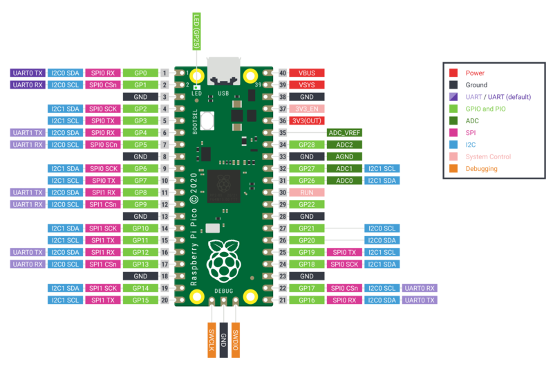

# Files for the IEEE Computer Society (South Australia) introduction to Pico course

- The files in `pico/lib/` need to be copied to the `lib` folder on the Pico
- The files in `pico/` need to be copied into the root folder on the Pico
- The example code files are in `examples/`

# Key information

- The contents of the kit is listed in `kit-contents.md`
- Raspberry Pi Pico board pinout:
 (Image source: Raspberry Pi Foundation)
- Datasheet: https://datasheets.raspberrypi.com/pico/pico-datasheet.pdf
- An i2c tutorial: https://learn.sparkfun.com/tutorials/i2c/all
- Circuit Python: https://circuitpython.org/
- Wikwi simulator: https://wokwi.com/
- Adafruit framebuffer: https://docs.circuitpython.org/projects/framebuf/en/latest/examples.html
- Python string format https://docs.python.org/3/library/string.html#format-specification-mini-language
